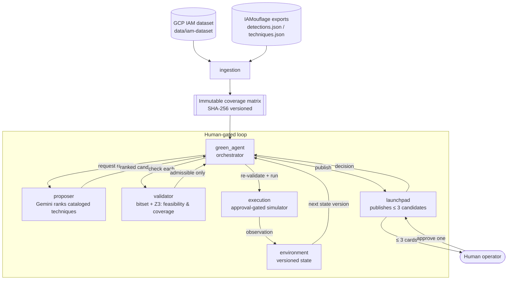

# Verisentinel

**Detection-aware next-action recommendation for GCP privilege escalation: a human-gated loop with deterministic verification of language-model proposals.**

Verisentinel is a decision-support tool for authorized GCP red-team work. Given a partially known
starting state, a language model (Gemini) proposes and ranks known IAM privilege-escalation
techniques — but the model never decides anything. A deterministic checker independently verifies
each proposal against two conditions:

1. **Feasibility** — the operator already holds the permissions the technique requires.
2. **Detection coverage** — the technique's permission footprint does *not* intersect a flattened
   table of permissions that public detection rules watch.

Only proposals that pass both checks are shown to the operator, at most three at a time. The model
shapes what is *offered*; deterministic resolution and validation decide what is *allowed*.

> **Scope / honesty.** "Detection" here means a match against a flattened permission table derived
> from public rules, **not** a real alarm firing. The default executor is an **offline simulator**;
> no real GCP execution provider is included. The tool measures reachability and coverage-overlap,
> not real-world evasion.

---

## Getting the repository

Verisentinel uses two git submodules, so clone recursively:

```bash
git clone --recurse-submodules https://github.com/moabid42/Verisentinel.git
cd Verisentinel
```

If you already cloned without `--recurse-submodules`, pull the submodules afterwards:

```bash
git submodule update --init --recursive
```

To later update the submodules to their latest tracked commits:

```bash
git submodule update --remote --recursive
```

### The two submodules

| Path | Source | What it is |
| --- | --- | --- |
| `code/IAMouflage` | [`moabid42/IAMouflage`](https://github.com/moabid42/IAMouflage) | Parses public detection rules (Sigma, Elastic, Google SecOps, Panther) and GCP attack techniques (HackTricks, Stratus) into the `detections.json` / `techniques.json` knowledge exports the planner consumes. Ships prebuilt exports, so you do **not** need Docker or Neo4j just to run the planner. |
| `data/iam-dataset` | [`iann0036/iam-dataset`](https://github.com/iann0036/iam-dataset) | The GCP IAM permission catalog (permissions, role maps, method-to-permission maps). Used by the ingestion step to build the coverage matrix. |

---

## Repository layout

```text
Verisentinel/
├── code/                  The tool (Python package + entrypoint)
│   ├── core/              Shared contracts, path config, errors, persistence, security helpers
│   ├── ingestion/         Loads the IAM dataset + IAMouflage exports → immutable SHA-256 matrix snapshot
│   ├── environment/       Versioned identity / permission / capability state ("Environment Brain")
│   ├── validator/         Boolean validation — bitset engine cross-checked against Z3 (SMT)
│   ├── proposer/          Gemini structured ranking, restricted to cataloged techniques only
│   ├── green_agent/       Engagement lifecycle + orchestration state machine
│   ├── launchpad/         Human-review API and dashboard (publishes ≤ 3 candidate cards)
│   ├── execution/         Approval, credential leasing, provider dispatch, and attempt records
│   ├── runner/            Typer CLI, application services, scenario loader, and terminal launchpad
│   ├── evaluation-pipeline/  Offline proposer+validator harness with ground-truth scenario solutions
│   ├── evaluation-tests/  Reproducible evidence harness (validator equivalence, corpus audit, plan review)
│   ├── tests/             Planner unit tests
│   ├── IAMouflage/        ← submodule (detection/technique knowledge builder + exports)
│   ├── run.py             Compatibility entrypoint for the unified Typer application
│   └── README.md          Full, detailed usage and configuration reference
└── data/
    └── iam-dataset/       ← submodule (GCP IAM permission catalog)
```

### How the components fit together



- **ingestion** turns the two knowledge sources into one immutable, hash-versioned coverage matrix.
- **proposer** asks Gemini to rank *only* techniques that exist in the catalog — it cannot invent actions.
- **validator** decides feasibility and coverage deterministically, and returns the exact missing
  permissions and intersecting detection rows. The bitset result is cross-checked against Z3.
- **green_agent** runs the cycle and holds exclusive authority over what gets published.
- **launchpad** shows the operator at most three admissible candidates and records the explicit choice.
- **execution** re-validates the approved action, atomically consumes its
  approval, resolves a short-lived credential lease, and dispatches through the
  provider boundary. The deterministic simulator is the only built-in provider.
- **environment** applies the resulting observation to produce the next immutable state version.

---

## Quickstart

All commands run from the `code/` directory.

**1. Install** (Python 3.12+):

```bash
cd code
python3 -m venv .venv
.venv/bin/pip install --upgrade pip
.venv/bin/pip install -e '.[dev]'
```

**2. Build a coverage-matrix snapshot** from every available detection source:

```bash
.venv/bin/verisentinel corpus build
```

**3. Configure Gemini and a scenario** by copying the tracked examples (the real files are gitignored):

```bash
cp .env.example .env                       # then add your GEMINI_API_KEY
cp scenario.example.yaml scenario.yaml     # then describe your authorized starting state
```

**4. Run the human-gated loop:**

```bash
.venv/bin/verisentinel run --scenario=scenario.yaml --credential-source=adc
```

Gemini ranks cataloged techniques, the validator filters them, and the terminal launchpad shows up
to three admissible candidates. Approving one triggers fresh validation, a one-time approval record,
a single guarded simulator call, and a new environment-state version.

**Run the tests:**

```bash
.venv/bin/python -m pytest
```

For the complete reference — matrix profiles, all environment variables, tracing/debug logs, the
evaluation pipeline, IAMouflage rebuilds, security notes, and troubleshooting — see
**[`code/README.md`](code/README.md)**.

---

## Configuration notes

- Secrets live in `code/.env` (gitignored). Never force-add it.
- The IAM dataset and IAMouflage export paths default to the submodule locations above, and can be
  overridden with `IAM_DATASET_PATH` and `IAMOUFLAGE_DATA_PATH`.
- Keep `EXECUTION_PROVIDER=simulator`; no real GCP execution provider is implemented.

## Security

This is a research prototype. The HTTP APIs and launchpad dashboard have no authentication, RBAC, or
CSRF protection — bind to localhost or place behind real auth and TLS. Use only against systems you
are explicitly authorized to test.
