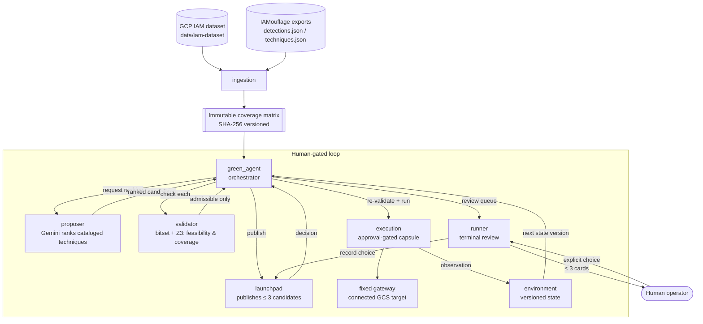

# Verisentinel

**Detection-aware next-action recommendation for GCP privilege escalation: a human-gated loop with deterministic verification of language-model proposals.**

Verisentinel is a decision-support tool for authorized GCP red-team work. Given a partially known
starting state, a language model (Gemini) proposes and ranks known IAM privilege-escalation
techniques — but the model never decides anything. A deterministic checker independently verifies
each proposal against two conditions:

> **Architecture status.** The current orchestrator has known architectural and operational
> issues. The next major version will substantially rewrite the orchestration layer instead of
> continuing to extend the current design incrementally. Until then, treat the copilot and
> execution workflow as experimental.

1. **Feasibility** — the operator already holds the permissions the technique requires.
2. **Detection coverage** — the technique's permission footprint does *not* intersect a flattened
   table of permissions that public detection rules watch.

Only proposals that pass both checks are shown to the operator, at most three at a time. The model
shapes what is *offered*; deterministic resolution and validation decide what is *allowed*.

> **Scope / honesty.** "Detection" here means a match against a flattened permission table derived
> from public rules, **not** a real alarm firing. Approved actions are delivered as typed envelopes
> to a connected GCS sandbox; cataloged techniques are not arbitrary cloud commands. The tool
> measures reachability and coverage-overlap, not real-world evasion.

---

## Getting the repository

Verisentinel uses two git submodules, so clone recursively:

```bash
git clone --recurse-submodules https://github.com/moabid42/Verisentinel.git
cd Verisentinel
```

If you already cloned without `--recurse-submodules`, pull the submodules afterwards:

```bash
git submodule update --init --recursive
```

To later update the submodules to their latest tracked commits:

```bash
git submodule update --remote --recursive
```

### The two submodules

| Path | Source | What it is |
| --- | --- | --- |
| `code/IAMouflage` | [`moabid42/IAMouflage`](https://github.com/moabid42/IAMouflage) | Parses public detection rules (Sigma, Elastic, Google SecOps, Panther) and GCP attack techniques (HackTricks, Stratus) into the `detections.json` / `techniques.json` knowledge exports the planner consumes. Ships prebuilt exports, so you do **not** need Docker or Neo4j just to run the planner. |
| `data/iam-dataset` | [`iann0036/iam-dataset`](https://github.com/iann0036/iam-dataset) | The GCP IAM permission catalog (permissions, role maps, method-to-permission maps). Used by the ingestion step to build the coverage matrix. |

---

## Repository layout

```text
Verisentinel/
├── code/                  The tool (Python package + entrypoint)
│   ├── core/              Shared contracts, path config, errors, persistence, security helpers
│   ├── ingestion/         Loads the IAM dataset + IAMouflage exports → immutable SHA-256 matrix snapshot
│   ├── environment/       Versioned identity / permission / capability state ("Environment Brain")
│   ├── validator/         Boolean validation — bitset engine cross-checked against Z3 (SMT)
│   ├── proposer/          Gemini structured ranking, restricted to cataloged techniques only
│   ├── green_agent/       Engagement lifecycle + orchestration state machine
│   ├── launchpad/         Human-review records and decision service (≤ 3 candidate cards)
│   ├── execution/         Approval, credential leasing, provider dispatch, and attempt records
│   ├── runner/            Typer CLI, application services, scenario loader, and terminal launchpad
│   ├── evaluation-pipeline/  Offline proposer+validator harness with ground-truth scenario solutions
│   ├── evaluation-tests/  Reproducible evidence harness (validator equivalence, corpus audit, plan review)
│   ├── tests/             Planner unit tests
│   ├── IAMouflage/        ← submodule (detection/technique knowledge builder + exports)
│   ├── run.py             Compatibility entrypoint for the unified Typer application
│   └── README.md          Full, detailed usage and configuration reference
└── data/
    └── iam-dataset/       ← submodule (GCP IAM permission catalog)
```

### How the components fit together



- **ingestion** turns the two knowledge sources into one immutable, hash-versioned coverage matrix.
- **proposer** asks Gemini to rank *only* techniques that exist in the catalog — it cannot invent actions.
- **validator** decides feasibility and coverage deterministically, and returns the exact missing
  permissions and intersecting detection rows. The bitset result is cross-checked against Z3.
- **green_agent** runs the cycle and holds exclusive authority over what gets published.
- **runner** presents at most three admissible candidates in the terminal; **launchpad** records the
  explicit choice.
- **execution** re-validates the approved action, atomically consumes its
  approval, resolves a short-lived credential lease, and dispatches through the
  provider boundary. The local capsule can reach only a fixed infrastructure
  gateway, which delivers the approved typed action to the connected target.
- **environment** applies the resulting observation to produce the next immutable state version.

---

## Quickstart

All commands run from the `code/` directory.

**1. Install** (Python 3.12+):

```bash
cd code
python3 -m venv .venv
.venv/bin/pip install --upgrade pip
.venv/bin/pip install -e '.[dev,copilot]'
```

**2. Build a coverage-matrix snapshot** from every available detection source:

```bash
.venv/bin/verisentinel corpus build
```

**3. Configure Gemini, DeepSeek Harness, and a scenario** by copying the tracked examples (the real files are gitignored):

```bash
cp .env.example .env                       # add GEMINI_API_KEY and DEEPSEEK_API_KEY
cp scenario.example.yaml scenario.yaml     # then describe your authorized starting state
```

**4. Run the human-gated loop:**

```bash
.venv/bin/verisentinel sandbox build
.venv/bin/verisentinel sandbox connect --scenario scenario.yaml
.venv/bin/verisentinel
```

Then enter the scenario command in the persistent terminal session:

```text
run scenario scenario.yaml --credential-source stdin
```

For development infrastructure, start with `verisentinel --dev`, run `infra
create --scenario PATH`, and then `sandbox connect INFRA_ID`. The prompt enters
the connected service-account workspace, where `env show` displays its bounded
scenario state and `env analyse` runs the validated, human-gated loop. Use
`sandbox disconnect` and `infra destroy INFRA_ID` for Terraform-backed cleanup.

Gemini ranks cataloged techniques, the validator filters them, and the terminal launchpad shows up
to three admissible candidates. When `copilot.enabled` is true, the selected technique enters a
persistent DeepSeek Harness coding session. The session authors `action.py`; a Docker-isolated fake
gateway rejects malformed envelopes and feeds the bounded failure back to the same session until
preflight passes. Only then is the complete file shown for approval. Approving it triggers fresh
validation and a one-time approval record,
a single guarded capsule delivery, and a new environment-state version. Scripts can use the direct
`verisentinel scenario run ...` command without opening the shell.

**Run the tests:**

```bash
.venv/bin/python -m pytest
```

For the complete reference — matrix profiles, all environment variables, tracing/debug logs, the
evaluation pipeline, IAMouflage rebuilds, security notes, and troubleshooting — see
**[`code/README.md`](code/README.md)**.

---

## Configuration notes

- Secrets live in `code/.env` (gitignored). Never force-add it.
- The IAM dataset and IAMouflage export paths default to the submodule locations above, and can be
  overridden with `IAM_DATASET_PATH` and `IAMOUFLAGE_DATA_PATH`.
- A run requires an active sandbox connection matching the scenario path,
  starting service account, credential reference, credential-source kind, and
  development mode.
- Tokens are never command arguments. Normal mode reads a short-lived
  service-account token from stdin by default; development mode uses ADC-backed
  service-account impersonation.

## Security

This is a research prototype. The HTTP APIs are not a production authentication boundary; bind
them to localhost or place them behind real authentication and TLS. Operator review is performed
in the CLI. Use only against systems you are explicitly authorized to test.
