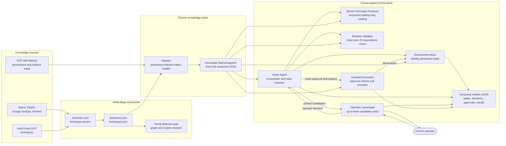
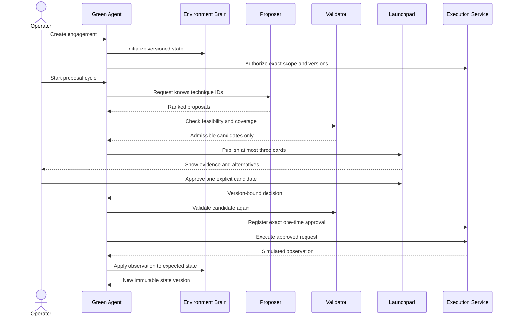

# IAM Coverage Planner

Human-gated GCP IAM technique planning with Boolean detection-coverage validation.

The planner combines a GCP IAM permission catalog with detection and technique data generated by
IAMouflage. It tracks the permissions of a controlled identity, asks Gemini to rank only cataloged
techniques, validates them, displays at most three candidates for human review, and simulates an
explicitly approved action.

> The normal human-gated backend is an **offline simulator**. The evaluation pipeline additionally
> provides a disposable local HTTP target; no real GCP execution provider is implemented.

For a detailed, beginner-friendly explanation of every package and the important modeling
assumptions, see [explain.md](explain.md).

## Architecture



The approval and execution path is deliberately separate from proposal generation:



## Repository layout

```text
code/
├── core/          Shared Pydantic contracts, paths, errors, persistence, and security helpers
├── ingestion/     IAM/IAMouflage loading and immutable matrix construction
├── environment/   Versioned identity, permission, resource, and capability state
├── validator/     Bitset and Z3-equivalent Boolean validation
├── proposer/      Candidate retrieval and required Gemini structured ranking
├── green_agent/   Engagement lifecycle and orchestration
├── launchpad/     Human review API and HTML dashboard
├── execution/     Approval, scope, registry, kill-switch, and simulator boundary
├── runner/        Direct scenario loader, terminal launchpad, and debug tracing
├── tests/         Main planner unit tests
├── IAMouflage/    Git submodule that builds the detection/technique knowledge exports
├── artifacts/     Generated matrix snapshots; gitignored
├── runtime/       Generated states, decisions, approvals, and executions; gitignored
├── pyproject.toml Python package and dependency configuration
└── explain.md     Detailed code walkthrough and limitations
```

## Prerequisites

- Python 3.12 or newer
- Git submodules initialized
- The GCP IAM dataset under `data/iam-dataset/gcp`, or `IAM_DATASET_PATH` pointing to it
- IAMouflage's generated `detections.json` and `techniques.json`, or
  `IAMOUFLAGE_DATA_PATH` pointing to their directory
- A Gemini API key
- `jq` for the shell examples below
- Docker only when rebuilding the IAMouflage Neo4j graph

From the repository root, initialize the submodule if necessary:

```bash
git submodule update --init --recursive
```

## Install

Run these commands from this `code` directory:

```bash
python3 -m venv .venv
.venv/bin/pip install --upgrade pip
.venv/bin/pip install -e '.[dev]'
```

The project uses editable installation so changes to local Python files take effect immediately.

## 1. Build a matrix snapshot

The planner needs a current immutable matrix before an engagement can be created.

Build a snapshot from every available detection source:

```bash
.venv/bin/python -m ingestion
```

Build a source-specific profile:

```bash
.venv/bin/python -m ingestion --source sigma
```

Select exact detections by repeating `--detection`:

```bash
.venv/bin/python -m ingestion \
  --detection 'sigma:example-id' \
  --detection 'panther:example-id'
```

The command prints the matrix version and counts. It writes:

```text
artifacts/snapshots/current.json
artifacts/snapshots/versions/<matrix-hash>.json
```

`current.json` is the **last profile published**, not necessarily the all-source profile. Inspect it
before interpreting validation results:

```bash
jq '{
  matrix_version,
  permissions: (.permissions | length),
  enabled_detections: (.enabled_detection_ids | length),
  sources: ([.detections[].source] | unique),
  coverage_permissions: (.coverage_indices | length),
  techniques: (.techniques | length),
  issues: (.report.issues | length)
}' artifacts/snapshots/current.json
```

The builder defaults to strict mode and refuses to publish data-consistency errors. Use
`--non-strict` only while diagnosing a known source problem.

## 2. Configure Gemini and the scenario

The current workflow calls the Python modules directly; it does not start the HTTP APIs.
`code/.env` and `code/scenario.yaml` have already been created and are gitignored so their secrets
cannot be committed accidentally. Tracked examples are available as `.env.example` and
`scenario.example.yaml`.

Put the Gemini key in `.env`:

```dotenv
GEMINI_API_KEY=replace-with-your-key
GEMINI_MODEL=gemini-3.5-flash
GEMINI_FALLBACK_MODELS=gemini-3.6-flash,gemini-3.1-flash-lite
GEMINI_API_MODE=generate_content
GEMINI_THINKING_LEVEL=medium
GEMINI_TIMEOUT_SECONDS=120
GEMINI_MAX_ATTEMPTS=3
GEMINI_HEARTBEAT_SECONDS=10
GEMINI_FORCE_IPV4=true
```

Describe the authorized starting state in `scenario.yaml`:

```yaml
name: storage-access-evaluation
objective: Evaluate unmonitored paths available to the starting service account
operator: human-operator@example.com
target_scope: projects/authorized-sandbox-project

starting_service_account:
  identity: start@authorized-sandbox-project.iam.gserviceaccount.com
  access_token: ya29.replace-with-a-short-lived-oauth-token
  permissions:
    - storage.objects.get

detections:
  sources:
    - sigma
  strict: true
```

The permissions are the effective permissions already known for that identity at `target_scope`.
They must exist in the current matrix. The prototype does not infer all effective permissions from
an OAuth token because GCP permissions are resource-specific.

The raw access token is loaded into an in-memory credential vault owned by the execution boundary.
Only an opaque SHA-256 reference is placed in the Environment Brain and persisted runtime records.
Neither the token nor the Gemini key is sent to the proposer or written to the debug trace.
Because the current execution provider is the simulator, it does not yet send that token to GCP.

## 3. Run the direct human-gated loop

From `code/`:

```bash
.venv/bin/python run.py --scenario=scenario.yaml
```

The runner reuses the current matrix and builds one automatically when none exists. To deliberately
rebuild it first:

```bash
.venv/bin/python run.py --scenario=scenario.yaml --rebuild-snapshot
```

Gemini ranks typed IAMouflage techniques. The Green Agent validates every proposal and prints up to
three admissible candidates. The terminal launchpad accepts only explicit input:

```text
1-3       approve that displayed candidate
r1-r3     reject that displayed candidate
a         request alternatives
x         reject all
q         terminate without execution
```

An approval triggers fresh validation, a one-time approval record, one guarded simulator call, and
a new environment-state version. Empty or malformed input never defaults to approval.

## Debug and model-conversation logs

Every run prints paths for an append-only JSONL trace and a dedicated model-conversation JSONL
under `runtime/traces/`. A human-readable progress log is written beside them. Event names are
also echoed to stderr. While Gemini is working, `request_heartbeat` is emitted every configured
interval; an application-level hard deadline ends the attempt even if the SDK blocks. Use
`--quiet-trace` to disable only the stderr echo.

The trace includes:

- the sanitized Gemini prompt and structured response;
- Gemini-provided thought summaries, when the selected model returns them;
- the model's explicit high-level `decision_summary`;
- model, latency, retry, status, and token-usage metadata;
- proposal-resolution and validator accept/reject reasons;
- published candidate IDs and the explicit operator decision; and
- execution and Environment Brain state transitions.

The model-conversation log stores the full redacted system message, user payload, structured
assistant response, high-level thought summaries, usage counts, retries, errors, and deadlines.
Raw private chain-of-thought and secret values are never logged.

Thought summaries are model-generated summaries, not raw private chain-of-thought. The trace is the
stable debugging contract: it exposes inputs, outputs, constraints, decisions, failures, and timing
without relying on hidden reasoning internals.

## Isolated evaluation pipeline

The generated Sigma scenario starts a disposable loopback-only IAM target, runs positive and
negative detector controls, automatically approves only the model's highest-ranked admissible
registered action, and writes a scored report:

```bash
.venv/bin/python run.py --scenario=evaluation-pipeline/scenario.yaml
```

The scenario's synthetic `starting_service_account.access_token` is the first target entrypoint.
It stays inside the credential/execution boundary and is never included in the Gemini prompt or
generated reports. Run artifacts land under `evaluation-pipeline/runs/`. See
[`evaluation-pipeline/README.md`](evaluation-pipeline/README.md) for the lifecycle, assertions, and
scenario fields.

The HTTP applications remain in the repository for later service deployment, but `run.py` does not
use them.

## Candidate validation rule

The permission universe is represented as bitsets. For a candidate technique:

```text
missing permissions = required permissions AND NOT current state
covered footprint    = technique footprint AND enabled detection coverage

feasible             = missing permissions is empty
outside coverage     = covered footprint is empty
admissible           = feasible AND outside coverage
```

The main planner uses a flattened permission union for detection coverage. IAMouflage's graph model
is richer: it considers complete DNF rule groups, rule paradigms, and default log visibility. Read
[explain.md](explain.md#22-the-most-important-limitations-and-traps) before treating `admissible` as
a general claim that an action is undetectable.

## Service inventory

Every service can be started with Uvicorn when direct API testing is useful:

| Service | Default URL | FastAPI application | Role |
| --- | --- | --- | --- |
| Ingestion | `http://ingestor:8001` | `ingestion.api:app` | build/read matrix snapshots |
| Environment | `http://environment:8002` | `environment.api:app` | state vectors and observations |
| Validator | `http://validator:8003` | `validator.api:app` | state/candidate validation |
| Proposer | `http://proposer:8004` | `proposer.api:app` | known-technique proposals |
| Green agent | `http://green-agent:8005` | `green_agent.api:app` | engagement lifecycle |
| Launchpad | `http://launchpad:8006` | `launchpad.api:app` | operator dashboard and decisions |
| Execution | `http://execution:8007` | `execution.api:app` | approval and simulator boundary |

There is no main-project Docker Compose file or all-services launcher. These APIs are not used by
the current direct runner.

## Configuration

| Variable | Default | Purpose |
| --- | --- | --- |
| `IAM_PLANNER_REPOSITORY_ROOT` | inferred repository root | override checkout location |
| `IAM_DATASET_PATH` | `data/iam-dataset/gcp` | IAM dataset directory |
| `IAMOUFLAGE_DATA_PATH` | `code/IAMouflage/code/data` | IAMouflage JSON directory |
| `IAM_PLANNER_ARTIFACTS` | `code/artifacts` | immutable matrix snapshots |
| `IAM_PLANNER_RUNTIME` | `code/runtime` | runtime JSON records |
| `CONTROL_PLANE_TOKEN` | unset; fails closed | shared internal control token |
| `LAUNCHPAD_URL` | local in-process service when unset in green agent | candidate publication gateway |
| `GREEN_AGENT_URL` | no decision forwarding when unset in launchpad | decision sink |
| `EXECUTION_URL` | local in-process simulator when unset in green agent | execution gateway |
| `EXECUTION_PROVIDER` | `simulator` | executor selection; only simulator exists |
| `EXECUTION_ENABLED` | `true` for simulator | execution kill switch |
| `VALIDATOR_ENGINE` | `bitset` | `bitset` or `smt` result engine |
| `VALIDATOR_VERIFY_SMT` | `true` | compare bitset result with Z3 |
| `GEMINI_API_KEY` | required for proposals | Gemini API key loaded from `.env` |
| `GEMINI_MODEL` | `gemini-3.5-flash` | Gemini model name |
| `GEMINI_FALLBACK_MODELS` | `gemini-3.6-flash,gemini-3.1-flash-lite` | ordered fallbacks for bounded retries |
| `GEMINI_API_MODE` | `generate_content` | stable structured-output transport; `interactions` is experimental |
| `GEMINI_THINKING_LEVEL` | `medium` | `minimal`, `low`, `medium`, or `high` |
| `GEMINI_TIMEOUT_SECONDS` | `120` | per-attempt request timeout |
| `GEMINI_MAX_ATTEMPTS` | `3` | bounded request attempts |
| `GEMINI_HEARTBEAT_SECONDS` | `10` | progress event interval during a model request |
| `GEMINI_FORCE_IPV4` | `true` | avoid broken IPv6 routes in the local Python client |

There is no deterministic proposal fallback. Gemini still never decides feasibility, coverage,
approval, or execution.

## Generated state

The application writes JSON under `artifacts/` and `runtime/`:

```text
artifacts/snapshots/
runtime/environment/
runtime/green-agent/
runtime/launchpad/
runtime/execution/
runtime/traces/
```

Records are written through temporary files followed by atomic replacement. Locks protect threads
inside one process; this is not a distributed transactional database. Both directories are
gitignored.

## Tests and linting

Run the main planner suite:

```bash
.venv/bin/python -m pytest
```

Run Ruff:

```bash
.venv/bin/ruff check core ingestion environment validator proposer green_agent launchpad execution runner tests
```

Run the IAMouflage suite separately:

```bash
cd IAMouflage/code
.venv/bin/python -m pytest -q
```

IAMouflage scenario tests do not require Docker or Neo4j.

## Rebuild IAMouflage data and graph

The planner can consume the generated JSON already under `IAMouflage/code/data`. To rebuild the
source exports, Neo4j graph, and findings from the upstream corpora:

```bash
cd IAMouflage/code
./run.sh
```

Other IAMouflage commands:

```bash
./run.sh analyze    # rerun Cypher reports against the existing graph
./run.sh refresh    # deliberately refresh pinned method/permission reference data
```

The full build starts Neo4j through Docker Compose and **replaces all nodes and relationships in the
configured Neo4j database**. Use only the dedicated local database unless that replacement is
intentional. See [IAMouflage/README.md](IAMouflage/README.md) for its prerequisites and detailed
pipeline.

## Troubleshooting

### No current matrix snapshot

Run:

```bash
.venv/bin/python -m ingestion
```

### `state contains permissions outside matrix`

At least one supplied permission is absent from the selected permission universe. Check spelling,
the selected matrix, and `ingestion/config/permission_resolution.json`.

### No candidates are displayed

Common reasons:

- the identity lacks a technique's required permissions;
- every feasible technique footprint intersects enabled detection coverage;
- proposed techniques were already completed or excluded after rejection;
- the selected detection profile is more restrictive than expected.

Inspect the cycle response and the engagement's `rejection_feedback`.

### Gemini is not being used

Add a non-empty `GEMINI_API_KEY` to `code/.env`. The proposer fails closed without it. Inspect the
latest `runtime/traces/*.jsonl` file for request start, timeout, retry, response, and usage events.

## Security notes

- Bind the prototype to localhost or place it behind real authentication and TLS.
- The launchpad dashboard and decision endpoint do not implement user login, RBAC, or CSRF defense.
- Ingestion, environment, validator, and proposer APIs are not authenticated.
- `code/.env` and `code/scenario.yaml` are ignored; never force-add them to Git.
- The direct runner stores the access token only in memory and persists an opaque credential
  reference. It also redacts configured secrets from trace strings.
- SHA-256 versions and digests provide integrity binding, not encryption.
- Keep `EXECUTION_PROVIDER=simulator`; no real GCP provider is implemented.
- The control token is an internal shared secret, not a complete production identity system.

## Current limitations

- Coverage in the main planner is a flattened union of permissions mentioned by enabled rules.
- Technique footprint currently equals required permissions by assumption.
- Effective identity permissions must be supplied; live GCP IAM discovery is not implemented.
- Optional technique permissions do not affect validation.
- Successful simulation starts another cycle; automatic objective-completion detection is not
  implemented.
- JSON persistence is intended for research and development, not horizontally scaled deployment.
