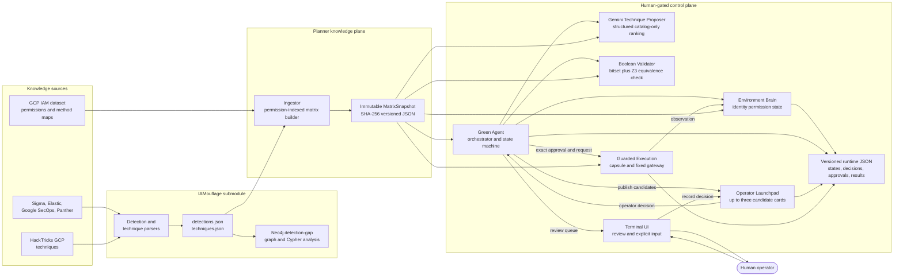
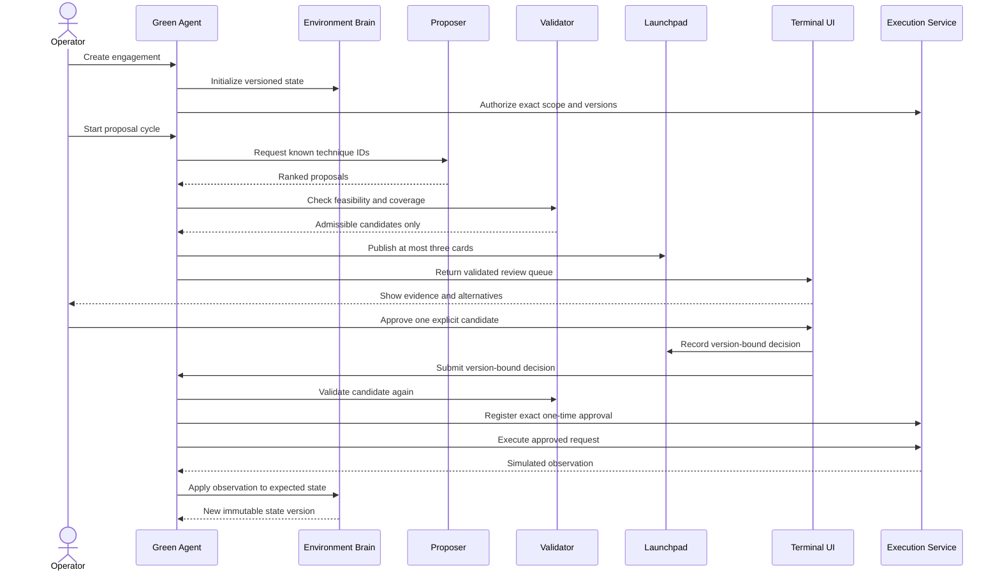

# IAM Coverage Planner

Human-gated GCP IAM technique planning with Boolean detection-coverage validation.

The planner combines a GCP IAM permission catalog with detection and technique data generated by
IAMouflage. It tracks the permissions of a controlled identity, asks Gemini to rank only cataloged
techniques, validates them, displays at most three candidates for human review, and delivers an
explicitly approved typed action to a connected sandbox target.

> The connected backend writes an approved action envelope to a scenario-specific GCS bucket. It
> does not translate cataloged techniques into arbitrary cloud commands or claim their real-world
> effects occurred.

For a detailed, beginner-friendly explanation of every package and the important modeling
assumptions, see [explain.md](explain.md).

## Architecture



The approval and execution path is deliberately separate from proposal generation:



## Repository layout

```text
code/
├── core/          Shared Pydantic contracts, paths, errors, persistence, and security helpers
├── ingestion/     IAM/IAMouflage loading and immutable matrix construction
├── environment/   Versioned identity, permission, resource, and capability state
├── validator/     Bitset and Z3-equivalent Boolean validation
├── proposer/      Candidate retrieval and required Gemini structured ranking
├── green_agent/   Engagement lifecycle and orchestration
├── launchpad/     Human review records and decision service
├── execution/     Approval, typed actions, credential leases, providers, and attempts
├── runner/        Unified Typer CLI, application services, scenario loader, and terminal UI
├── tests/         Main planner unit tests
├── IAMouflage/    Git submodule that builds the detection/technique knowledge exports
├── artifacts/     Generated matrix snapshots; gitignored
├── runtime/       Generated states, decisions, approvals, and executions; gitignored
├── pyproject.toml Python package and dependency configuration
└── explain.md     Detailed code walkthrough and limitations
```

## Prerequisites

- Python 3.12 or newer
- Git submodules initialized
- The GCP IAM dataset under `data/iam-dataset/gcp`, or `IAM_DATASET_PATH` pointing to it
- IAMouflage's generated `detections.json` and `techniques.json`, or
  `IAMOUFLAGE_DATA_PATH` pointing to their directory
- A Gemini API key
- `jq` for the shell examples below
- Docker when rebuilding the IAMouflage Neo4j graph or testing the optional
  local execution capsule

From the repository root, initialize the submodule if necessary:

```bash
git submodule update --init --recursive
```

## Install

Run these commands from this `code` directory:

```bash
python3 -m venv .venv
.venv/bin/pip install --upgrade pip
.venv/bin/pip install -e '.[dev]'
```

The project uses editable installation so changes to local Python files take effect immediately.

## Command overview

Use the single installed command application for maintained workflows:

```text
verisentinel
verisentinel shell --resume SESSION_ID
verisentinel scenario validate PATH
verisentinel auth inspect --credential-source SOURCE
verisentinel corpus build
verisentinel corpus status
verisentinel sandbox build
verisentinel sandbox doctor
verisentinel scenario run PATH --credential-source SOURCE
verisentinel session list
verisentinel session show SESSION_ID
verisentinel session resume SESSION_ID
```

With an interactive terminal, `.venv/bin/verisentinel` starts a persistent
command session. Redirected or non-interactive invocation prints the compact
command launcher instead. Direct subcommands remain stable for scripts. See the
[`terminal shell guide`](../docs/usage/terminal-shell.md) for natural command
forms, slash commands, persistence, and resumption.

Run `.venv/bin/verisentinel --help` or nested `--help` commands for complete
option descriptions. See
[`../docs/usage/milestone02.md`](../docs/usage/milestone02.md) for manual tests,
exit codes, and security checks. Capsule setup and isolation checks are in the
[`Milestone 3 guide`](../docs/usage/milestone03.md).

## 1. Build a matrix snapshot

The planner needs a current immutable matrix before an engagement can be created.

Build a snapshot from every available detection source:

```bash
.venv/bin/verisentinel corpus build
```

The command prints the matrix version and counts. It writes:

```text
artifacts/snapshots/current.json
artifacts/snapshots/versions/<matrix-hash>.json
```

`current.json` is the **last profile published**, not necessarily the all-source profile. Inspect it
before interpreting validation results:

```bash
jq '{
  matrix_version,
  permissions: (.permissions | length),
  enabled_detections: (.enabled_detection_ids | length),
  sources: ([.detections[].source] | unique),
  coverage_permissions: (.coverage_indices | length),
  techniques: (.techniques | length),
  issues: (.report.issues | length)
}' artifacts/snapshots/current.json
```

The builder defaults to strict mode and refuses to publish data-consistency
errors. A scenario-specific source or detection profile is built when
`verisentinel scenario run` receives `--rebuild-snapshot`.

## 2. Configure Gemini and the scenario

The current workflow uses one installed Typer application; it does not start the
HTTP APIs. `code/.env` and `code/scenario.yaml` are gitignored local
configuration files. Tracked examples are available as `.env.example` and
`scenario.example.yaml`.

Put the Gemini key in `.env`:

```dotenv
GEMINI_API_KEY=replace-with-your-key
GEMINI_MODEL=gemini-3.5-flash
GEMINI_FALLBACK_MODELS=gemini-3.6-flash,gemini-3.1-flash-lite
GEMINI_API_MODE=generate_content
GEMINI_THINKING_LEVEL=medium
GEMINI_TIMEOUT_SECONDS=120
GEMINI_MAX_ATTEMPTS=3
GEMINI_HEARTBEAT_SECONDS=10
GEMINI_FORCE_IPV4=true
```

Describe the authorized starting state in `scenario.yaml`:

```yaml
name: storage-access-evaluation
objective: Evaluate unmonitored paths available to the starting service account
operator: human-operator@example.com
target_scope: projects/authorized-sandbox-project

infrastructure:
  path: projects/authorized-sandbox-project/buckets/authorized-action-sink

starting_service_account:
  identity: start@authorized-sandbox-project.iam.gserviceaccount.com
  credential_ref: run/default
  permissions:
    - storage.objects.get

detections:
  sources:
    - sigma
  strict: true
```

The permissions are the effective permissions already known for that identity at `target_scope`.
They must exist in the current matrix. The prototype does not infer all effective permissions from
a credential reference because GCP permissions are resource-specific.

`credential_ref` is an opaque identifier, not a token or credential-source descriptor. It is the
only credential-related value placed in the Environment Brain and persisted runtime records. Never
put a raw credential in the scenario file.

Supply the source independently when starting the runner. The source descriptor selects where the
execution boundary will resolve a short-lived credential; it never contains the credential value:

| Source | Behavior |
| --- | --- |
| `stdin` | Read one supplied short-lived token without terminal echo. |
| `file:<path>` | Read one supplied short-lived token from a file inaccessible to group and other users. |
| `env:<name>` | Read one supplied short-lived token from the named environment variable. |
| `adc` | Resolve Application Default Credentials. Service-account key credentials are rejected. |
| `impersonate:<principal>` | Use base ADC to mint a short-lived token for the exact service-account principal. |

Supplied tokens are introspected for a verified principal and expiry. Resolution rejects missing,
empty, unverifiable, expired, near-expiry, or principal-mismatched credentials. A connection and a
run resolve credentials independently so no token has to be retained between commands.

## 3. Build and connect the sandbox

Build the fixed capsule and infrastructure-gateway images and their internal Docker network:

```bash
.venv/bin/verisentinel sandbox build
.venv/bin/verisentinel sandbox doctor
```

In normal mode, connect to the remote bucket declared in the scenario. With no source option, the
command reads a short-lived token from hidden stdin and verifies that it belongs to the scenario's
starting service account:

```bash
.venv/bin/verisentinel sandbox connect --scenario scenario.yaml
```

Do not place the token after `sandbox connect`; positional credential arguments are unsupported.
For automation, use a protected file or environment source explicitly.

Development mode can create the scenario bucket with gcloud Application Default Credentials,
grant its starting service account object-creation access, and connect by opaque infrastructure ID:

```bash
gcloud auth application-default login
python3 run.py --dev
```

```text
infra create --scenario scenario.yaml
sandbox connect infra_REPLACE_WITH_RETURNED_ID --scenario scenario.yaml
run scenario scenario.yaml --credential-source \
  impersonate:start@authorized-sandbox-project.iam.gserviceaccount.com
```

The development bucket has uniform access, enforced public-access prevention, and a one-day object
lifecycle. The execution capsule remains on an internal network. A separate fixed gateway container
has outbound access and writes only approved typed action envelopes to the exact configured bucket.
The ADC principal needs permission to create the declared bucket and read and update its IAM policy;
ADC impersonation also requires permission to mint a token for the scenario service account.

## 4. Run the direct human-gated loop

From an interactive terminal in `code/`, open the shell and enter the run:

```bash
.venv/bin/verisentinel
```

```text
run scenario scenario.yaml --credential-source stdin
```

For scripts, use
`.venv/bin/verisentinel scenario run scenario.yaml --credential-source=stdin`.

The runner reuses the current matrix and builds one automatically when none exists. To deliberately
rebuild it first:

```bash
.venv/bin/verisentinel scenario run scenario.yaml \
  --credential-source=stdin \
  --rebuild-snapshot
```

Gemini ranks typed IAMouflage techniques. The Green Agent validates every proposal and prints up to
three admissible candidates. The terminal launchpad accepts only explicit input:

```text
1-3       approve that displayed candidate
r1-r3     reject that displayed candidate
a         request alternatives
x         reject all
q         terminate without execution
```

An approval triggers fresh validation, a one-time approval record, one guarded capsule delivery,
and a new environment-state version. Rejecting or terminating never calls the provider. Empty or
malformed input never defaults to approval.

## Debug and model-conversation logs

Every run prints paths for an append-only JSONL trace and a dedicated model-conversation JSONL
under `runtime/traces/`. A human-readable progress log is written beside them. Event names are
also echoed to stderr. While Gemini is working, `request_heartbeat` is emitted every configured
interval; an application-level hard deadline ends the attempt even if the SDK blocks. Use
`--quiet-trace` to disable only the stderr echo.

The trace includes:

- the sanitized Gemini prompt and structured response;
- Gemini-provided thought summaries, when the selected model returns them;
- the model's explicit high-level `decision_summary`;
- model, latency, retry, status, and token-usage metadata;
- proposal-resolution and validator accept/reject reasons;
- published candidate IDs and the explicit operator decision; and
- execution and Environment Brain state transitions.

The model-conversation log stores the full redacted system message, user payload, structured
assistant response, high-level thought summaries, usage counts, retries, errors, and deadlines.
Raw private chain-of-thought and secret values are never logged.

Thought summaries are model-generated summaries, not raw private chain-of-thought. The trace is the
stable debugging contract: it exposes inputs, outputs, constraints, decisions, failures, and timing
without relying on hidden reasoning internals.

## Isolated evaluation pipeline

The evaluation pipeline uses its own offline state schema, automatically selects
only admissible registered actions according to its evaluation policy, and
writes a scored report:

```bash
.venv/bin/python evaluation-pipeline/run.py \
  --scenario=evaluation-pipeline/scenarios/iamouflage-sigma-cloudbuild-actas.yaml
```

The evaluation pipeline does not load an execution credential or invoke the
maintained execution boundary. Run artifacts land under
`evaluation-pipeline/runs/`. See
[`evaluation-pipeline/README.md`](evaluation-pipeline/README.md) for its
lifecycle, assertions, and scenario fields.

The HTTP applications remain in the repository for later service deployment,
but the `verisentinel` CLI does not use them.

## Candidate validation rule

The permission universe is represented as bitsets. For a candidate technique:

```text
missing permissions = required permissions AND NOT current state
covered footprint    = technique footprint AND enabled detection coverage

feasible             = missing permissions is empty
outside coverage     = covered footprint is empty
admissible           = feasible AND outside coverage
```

The main planner uses a flattened permission union for detection coverage. IAMouflage's graph model
is richer: it considers complete DNF rule groups, rule paradigms, and default log visibility. Read
[explain.md](explain.md#22-the-most-important-limitations-and-traps) before treating `admissible` as
a general claim that an action is undetectable.

## Service inventory

Every service can be started with Uvicorn when direct API testing is useful:

| Service | Default URL | FastAPI application | Role |
| --- | --- | --- | --- |
| Ingestion | `http://ingestor:8001` | `ingestion.api:app` | build/read matrix snapshots |
| Environment | `http://environment:8002` | `environment.api:app` | state vectors and observations |
| Validator | `http://validator:8003` | `validator.api:app` | state/candidate validation |
| Proposer | `http://proposer:8004` | `proposer.api:app` | known-technique proposals |
| Green agent | `http://green-agent:8005` | `green_agent.api:app` | engagement lifecycle |
| Launchpad | `http://launchpad:8006` | `launchpad.api:app` | candidate and decision records |
| Execution | `http://execution:8007` | `execution.api:app` | guarded provider boundary |

There is no main-project Docker Compose file or all-services launcher. These APIs are not used by
the current direct runner.

## Configuration

| Variable | Default | Purpose |
| --- | --- | --- |
| `IAM_PLANNER_REPOSITORY_ROOT` | inferred repository root | override checkout location |
| `IAM_DATASET_PATH` | `data/iam-dataset/gcp` | IAM dataset directory |
| `IAMOUFLAGE_DATA_PATH` | `code/IAMouflage/code/data` | IAMouflage JSON directory |
| `IAM_PLANNER_ARTIFACTS` | `code/artifacts` | immutable matrix snapshots |
| `IAM_PLANNER_RUNTIME` | `code/runtime` | runtime JSON records |
| `CONTROL_PLANE_TOKEN` | unset; fails closed | shared internal control token |
| `LAUNCHPAD_URL` | local in-process service when unset in green agent | candidate publication gateway |
| `GREEN_AGENT_URL` | no decision forwarding when unset in launchpad | decision sink |
| `EXECUTION_URL` | local in-process service when unset in green agent | execution API gateway |
| `EXECUTION_PROVIDER` | `simulator` | API-service provider selection; the direct runner requires its connected capsule |
| `EXECUTION_ENABLED` | provider-dependent | execution kill switch; the connected direct runner enables one approved capsule call |
| `VERISENTINEL_CAPSULE_NETWORK` | `verisentinel-capsule` | internal Docker network used by the capsule and fixed infrastructure gateway |
| `VALIDATOR_ENGINE` | `bitset` | `bitset` or `smt` result engine |
| `VALIDATOR_VERIFY_SMT` | `true` | compare bitset result with Z3 |
| `GEMINI_API_KEY` | required for proposals | Gemini API key loaded from `.env` |
| `GEMINI_MODEL` | `gemini-3.5-flash` | Gemini model name |
| `GEMINI_FALLBACK_MODELS` | `gemini-3.6-flash,gemini-3.1-flash-lite` | ordered fallbacks for bounded retries |
| `GEMINI_API_MODE` | `generate_content` | stable structured-output transport; `interactions` is experimental |
| `GEMINI_THINKING_LEVEL` | `medium` | `minimal`, `low`, `medium`, or `high` |
| `GEMINI_TIMEOUT_SECONDS` | `120` | per-attempt request timeout |
| `GEMINI_MAX_ATTEMPTS` | `3` | bounded request attempts |
| `GEMINI_HEARTBEAT_SECONDS` | `10` | progress event interval during a model request |
| `GEMINI_FORCE_IPV4` | `true` | avoid broken IPv6 routes in the local Python client |

There is no deterministic proposal fallback. Gemini still never decides feasibility, coverage,
approval, or execution.

## Execution contracts

The action registry converts a catalog technique into an immutable `ActionDefinition` and
`ExecutionSpec`. Current technique actions use a strict empty parameter model: unknown fields,
command strings, and other free-form arguments fail validation. The spec binds the exact action,
identity, target, credential reference, validator result, approval, state version, and matrix
version before it can reach a provider. Existing persisted requests with an empty `arguments`
object remain readable.

`ExecutionService` applies one common path for the kill switch, exact approval
and version checks, registered action resolution, atomic attempt reservation,
late credential resolution, provider invocation, observation validation, and
record finalization. Starting an attempt consumes the approval even when
credential resolution or the provider fails, times out, is cancelled, or is
interrupted. A retry therefore requires a new validation and explicit approval.

Provider observations must match the approved engagement, action, identity, and
target. They are size-bounded and rejected if they reproduce credential
material. Persisted attempt records contain only identifiers, provider name,
status, timestamps, and a fixed non-sensitive outcome code.

## Generated state

The application writes JSON under `artifacts/` and `runtime/`:

```text
artifacts/snapshots/
runtime/environment/
runtime/green-agent/
runtime/launchpad/
runtime/execution/
runtime/traces/
```

Records are written through temporary files followed by atomic replacement. Locks protect threads
inside one process; this is not a distributed transactional database. Both directories are
gitignored.

## Tests and linting

Run the main planner suite:

```bash
.venv/bin/python -m pytest
```

Run Ruff:

```bash
.venv/bin/ruff check core ingestion environment validator proposer green_agent launchpad execution runner tests
```

Run the IAMouflage suite separately:

```bash
cd IAMouflage/code
.venv/bin/python -m pytest -q
```

IAMouflage scenario tests do not require Docker or Neo4j.

## Rebuild IAMouflage data and graph

The planner can consume the generated JSON already under `IAMouflage/code/data`. To rebuild the
source exports, Neo4j graph, and findings from the upstream corpora:

```bash
cd IAMouflage/code
./run.sh
```

Other IAMouflage commands:

```bash
./run.sh analyze    # rerun Cypher reports against the existing graph
./run.sh refresh    # deliberately refresh pinned method/permission reference data
```

The full build starts Neo4j through Docker Compose and **replaces all nodes and relationships in the
configured Neo4j database**. Use only the dedicated local database unless that replacement is
intentional. See [IAMouflage/README.md](IAMouflage/README.md) for its prerequisites and detailed
pipeline.

## Troubleshooting

### No current matrix snapshot

Run:

```bash
.venv/bin/verisentinel corpus build
```

### `state contains permissions outside matrix`

At least one supplied permission is absent from the selected permission universe. Check spelling,
the selected matrix, and `ingestion/config/permission_resolution.json`.

### No candidates are displayed

Common reasons:

- the identity lacks a technique's required permissions;
- every feasible technique footprint intersects enabled detection coverage;
- proposed techniques were already completed or excluded after rejection;
- the selected detection profile is more restrictive than expected.

Inspect the cycle response and the engagement's `rejection_feedback`.

### Gemini is not being used

Add a non-empty `GEMINI_API_KEY` to `code/.env`. The proposer fails closed without it. Inspect the
latest `runtime/traces/*.jsonl` file for request start, timeout, retry, response, and usage events.

## Security notes

- Bind the prototype to localhost or place it behind real authentication and TLS.
- The launchpad decision endpoint does not implement operator login or RBAC.
- Ingestion, environment, validator, and proposer APIs are not authenticated.
- `code/.env` and `code/scenario.yaml` are ignored; never force-add them to Git.
- The direct runner passes only a source descriptor and opaque reference to the
  execution boundary. The boundary resolves credential material immediately
  before one provider call, and the short-lived lease clears its material on
  every exit path.
- SHA-256 versions and digests provide integrity binding, not encryption.
- Raw credentials are never accepted as positional command arguments, stored in
  the scenario or connection record, or passed in Docker arguments or environment.
- The capsule has no external route. Only the fixed gateway joins an outbound
  bridge, and it delivers the approved envelope to the scenario bucket.
- The control token is an internal shared secret, not a complete production identity system.

## Current limitations

- Coverage in the main planner is a flattened union of permissions mentioned by enabled rules.
- Technique footprint currently equals required permissions by assumption.
- Effective identity permissions must be supplied; live GCP IAM discovery is not implemented.
- Optional technique permissions do not affect validation.
- Successful delivery starts another cycle; automatic objective-completion detection is not
  implemented.
- JSON persistence is intended for research and development, not horizontally scaled deployment.
