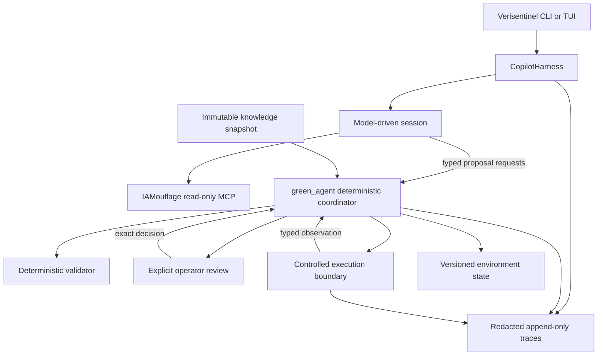

# ADR-0001: Separate Copilot Sessions from Deterministic Authority

- Status: Accepted
- Date: 2026-08-26

## Context

The application already separates model-assisted proposal ranking from
deterministic validation and orchestration. `green_agent` controls engagement
state, publishes only validated candidates, records explicit operator decisions,
and submits exact approved requests through an execution gateway. The validator
uses an immutable, versioned knowledge snapshot.

The planned copilot adds session management, conversational planning, tool use,
resumption, and trace inspection. Those capabilities are useful for exploration
but must not become an alternate authorization path. A model session can be
unavailable, produce malformed output, use a changing knowledge service, or run
under a third-party harness whose APIs are not stable.

IAMouflage already offers a read-only MCP integration boundary in its external
submodule. DeepSeek Harness offers plugin-composed sessions, a subprocess-driven
Python SDK, and an MCP client. As of this decision, DeepSeek describes the
harness as a developer preview. Its adapter therefore requires an isolation and
fallback boundary.

## Decision

Use two orchestration layers with one direction of authority:

### Copilot session layer

Define a repository-owned `CopilotHarness` protocol. A harness implementation may
manage model conversations, plans, session persistence, streaming events,
read-only knowledge tools, and trace events. It may submit typed requests to the
deterministic coordinator and render the coordinator's results.

The session layer must not:

- receive cloud execution credentials or model-facing credential tools;
- register or consume approvals;
- change environment state or matrix versions;
- decide that a candidate is admissible;
- invoke an execution provider; or
- bypass the public coordinator and execution contracts.

### Deterministic authority layer

Retain `green_agent` as the sole workflow authority. It continues to own status
transitions, version checks, candidate publication, explicit decision handling,
fresh validation before execution, approval registration, and application of
typed observations to immutable state.

The existing direct workflow remains supported without a copilot. Harness
availability must not change validation, approval, or execution semantics.

### Knowledge boundary

Use IAMouflage in two distinct ways:

- A copilot may query its existing MCP server for interactive, read-only context.
- Ingestion and validation continue to use an immutable repository snapshot as
  the authoritative decision input.

Record the MCP corpus revision, immutable matrix version, and session adapter
version in traces. A conversational MCP result is never evidence that replaces a
validator result.

### DeepSeek adapter

Implement DeepSeek only as an optional `CopilotHarness` adapter after the shared
protocol exists. Pin the SDK and matching runtime to one exact release or commit;
do not track a moving branch or unconstrained version range.

Before a session starts, run a readiness check that verifies the configured MCP
server started and the expected read-only tool names are registered. A timeout,
missing tool, protocol mismatch, or adapter failure stops that copilot session
without changing deterministic state. The direct workflow remains available.

Keep the integration experimental while DeepSeek Harness remains in developer
preview. Do not modify or vendor the IAMouflage submodule to implement the
adapter.

### Coordination ownership

One coordinating implementation agent owns shared contracts, CLI integration,
and final verification. Parallel work is limited to independent adapters or
providers with non-overlapping files and tests; shared model changes are
sequenced through the coordinator.

## Consequences

- Model sessions can evolve without weakening current approval or version
  invariants.
- Interactive knowledge can be current and convenient while validation remains
  reproducible.
- The optional adapter adds startup and compatibility checks, but its failure is
  contained to the copilot experience.
- Session traces and deterministic execution records remain separate data
  classes with shared opaque identifiers rather than shared secrets.
- A future harness replacement implements one repository-owned protocol instead
  of rewriting the application as third-party plugins.

## Rejected Alternatives

### Replace `green_agent` with the harness loop

Rejected because model-loop orchestration does not provide the application's
deterministic status, version, validation, approval, and consumption invariants.

### Give the copilot an authenticated shell

Rejected because a general-purpose model-controlled shell would combine planning
and execution authority and expose credentials outside the controlled execution
boundary.

### Use live MCP responses as validator input

Rejected because changing service responses would make authorization decisions
non-reproducible and would weaken snapshot version binding.

## References

- [DeepSeek Harness developer preview](https://www.deepseek.com/harness/en/)
- [DeepSeek Harness Python SDK](https://github.com/deepseek-ai/deepseek-harness/blob/master/python/README.md)
- [DeepSeek Harness MCP client](https://github.com/deepseek-ai/deepseek-harness/blob/master/packages/mcp/mcp-client/README.md)
