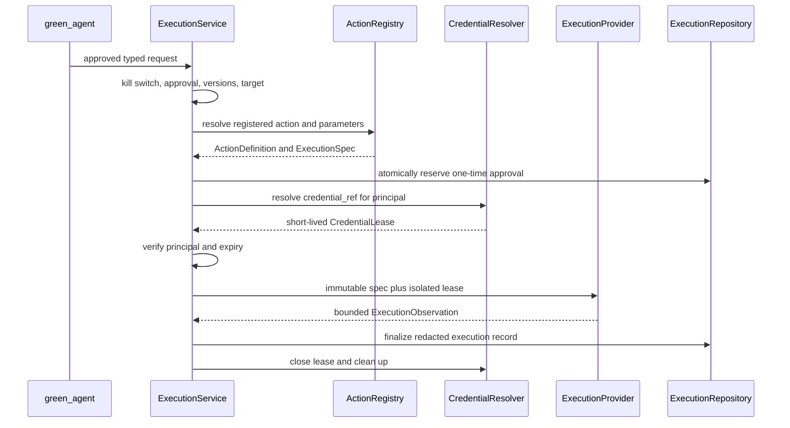

# ADR-0002: Isolate Credentials and Approved Execution

- Status: Accepted
- Date: 2026-08-26

## Context

The current scenario contract requires a raw `access_token`. Pydantic hides the
value after parsing, and the runner converts it to an in-memory reference before
creating environment state, but the source YAML still contains plaintext. The
current `ExecutionService` accepts only the simulator, and `ActionRegistry`
resolves catalog metadata while rejecting all action arguments. There is no
typed provider-neutral operation contract or isolated runtime for a real
provider.

The current execution path already has invariants worth retaining: an explicit
target allow-list, state and matrix version checks, exact approval binding, a
kill switch, a finite action registry, and one-time approval records.

Credentials must not cross into scenario persistence, process arguments, model
context, general-purpose shells, traces, or errors. A target scope checked by the
application does not restrict where a bearer credential is valid; the principal
must also have narrowly configured permissions at the provider.

## Decision

Make `execution` the only boundary that can turn an opaque credential reference
into short-lived credential material. All providers use the same deterministic
authorization and action-resolution path.



### Scenario and command boundary

Remove `starting_service_account.access_token` from the scenario contract without
a compatibility bridge. A scenario containing `access_token` or any other
unknown credential field fails strict validation. Require:

```yaml
starting_service_account:
  identity: planner-run@authorized-project.iam.gserviceaccount.com
  credential_ref: run/default
  permissions:
    - example.resource.get
```

The run command associates that opaque reference with a source independently:

```text
verisentinel run --scenario scenario.yaml --credential-source stdin
```

Support exactly these initial source forms:

| Source | Meaning |
| --- | --- |
| `stdin` | Read one supplied short-lived access token without echo. |
| `file:<path>` | Read one supplied short-lived access token from a protected file. |
| `env:<name>` | Read one supplied short-lived access token from the named environment variable. |
| `adc` | Resolve Application Default Credentials at execution time. |
| `impersonate:<principal>` | Use base ADC to obtain a short-lived credential for the exact principal. |

The source descriptor contains a source kind and locator, never a credential
value. Do not accept a token, authorization header, refresh token, or service
account key as a command argument. Do not add a generic source scheme or silently
fall back between sources.

`file`, `env`, and `stdin` are compatibility sources for short-lived access
tokens, not service-account key files. Long-lived key support is outside this
decision.

### Shared typed contracts

Extend the existing shared Pydantic contracts rather than pass untyped mappings:

- `ActionDefinition` gives a stable registered action ID, a provider operation,
  and the concrete parameter model allowed for that action. It cannot contain a
  shell command.
- `ExecutionSpec` is the immutable provider input. It contains the exact
  approval-bound identifiers and versions, target, validated action parameters,
  output limits, timeout, and opaque credential reference.
- `ExecutionObservation` remains the bounded provider result used by
  orchestration. Extend the existing model only when provider-neutral evidence
  is required; do not persist raw responses.
- `CredentialLease` is a runtime-only, non-serializable contract containing the
  verified principal, expiry, isolated credential material, and cleanup
  behavior. Its string representation must be redacted.

Each action owns a concrete parameter model. Empty parameters are valid for an
action that declares none. Unknown fields, arbitrary commands, shell fragments,
and unregistered actions fail before approval consumption or credential
resolution.

### Provider protocol

Define a narrow `ExecutionProvider` protocol that accepts an immutable
`ExecutionSpec` and an isolated credential lease and returns a typed
`ExecutionObservation`. Refactor the simulator to implement the protocol without
changing its deterministic effects or making credentials observable.

Provider selection occurs during application assembly. An unknown or
unavailable provider fails closed. Every provider uses the common service path;
providers do not reimplement approval, target, version, action, or credential
policy.

An approval is atomically reserved immediately before credential resolution and
provider invocation. Starting an attempt consumes the approval, including when
the provider times out or fails, so concurrent or automatic replay is not
possible. A later attempt requires a new validation and explicit approval.

### Credential lease rules

Resolve credentials after all static authorization and action checks and
immediately before invoking the provider. The resolver must establish a verified
principal and expiry for every lease. Reject missing references, unsupported
source forms, unverifiable principals, principal mismatches, and expired or
near-expiry leases.

Limit the lease to one provider attempt. Close it in guaranteed cleanup on
success, failure, timeout, cancellation, and interruption. Redaction applies to
the credential, derived headers, temporary file content, provider messages, and
any value that reproduces credential material.

Persist only the opaque credential reference, verified principal, non-sensitive
lease metadata, provider name, typed observation, and record identifiers. Never
put credential material in JSON, traces, errors, process arguments, model
prompts, session state, or output summaries.

Prefer provider-managed attached identity for workloads running on Google Cloud,
Workload Identity Federation for external managed workloads, and service-account
impersonation for local operator sessions. Supplied tokens are a bounded
compatibility path. The underlying identity must be dedicated to the controlled
environment and have only the required resource permissions.

Service-account access tokens normally remain valid until expiry and cannot be
revoked individually. Lease cleanup removes local material but does not revoke an
issued token, so short lifetime and narrow IAM bindings are required controls.

### Local execution capsule

The first non-simulator provider is an ephemeral local container with:

- a repository-owned image pinned by digest and a fixed entrypoint;
- one immutable serialized `ExecutionSpec`, mounted read-only;
- a non-root user, read-only root filesystem, temporary writable filesystems,
  dropped Linux capabilities, and no privilege escalation;
- explicit CPU, memory, process, timeout, and output limits;
- a temporary credential file at a fixed in-container path, never an argument or
  environment value;
- network access only to a private mocked endpoint for the initial milestone;
  and
- guaranteed container, temporary file, and lease cleanup.

The entrypoint dispatches only registered typed operations. It does not expose a
shell or accept a command string. Provider stdout, stderr, and response bodies
are bounded and redacted before translation into an observation.

Live Google Cloud operations and selection of a remote managed runtime require a
later decision record. The local capsule must be measured and pass its acceptance
gate before either is considered.

## Consequences

- Existing scenario files with embedded tokens intentionally stop working and
  must be rewritten with opaque references.
- Application services can test authorization, source parsing, lease validation,
  and provider dispatch independently with deterministic fakes.
- The simulator remains the default while sharing the same provider contract.
- A failed provider attempt cannot be replayed under an old approval.
- Container cleanup limits local exposure but does not substitute for provider
  identity design, token expiry, or resource-side authorization.

## Rejected Alternatives

### Preserve embedded tokens during a transition

Rejected because a compatibility path would keep plaintext credentials in the
scenario format and complicate the boundary that this change is intended to
establish.

### Pass tokens through command arguments or environment variables to a capsule

Rejected because process inspection, logs, crash reports, and inherited
environments can expose those values. The fixed temporary file is narrower and
has explicit cleanup ownership.

### Let providers accept arbitrary commands

Rejected because command allow-listing and argument filtering are weaker and
less testable than registered operations with action-specific parameter models.

### Treat target scope as a credential restriction

Rejected because the application allow-list does not cryptographically limit a
bearer credential. Resource-side permissions on a dedicated identity remain the
effective access boundary.

## References

- [Google Cloud service-account best practices](https://docs.cloud.google.com/iam/docs/best-practices-service-accounts)
- [Google Cloud service-account impersonation](https://docs.cloud.google.com/iam/docs/service-account-impersonation)
- [Google Cloud Application Default Credentials](https://docs.cloud.google.com/docs/authentication/application-default-credentials)
- [Google Cloud token types](https://cloud.google.com/docs/authentication/token-types)
